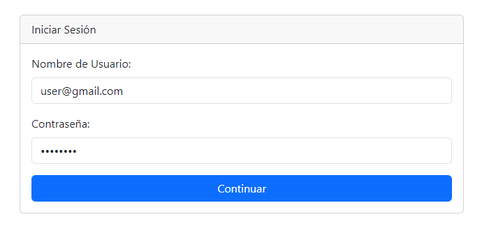
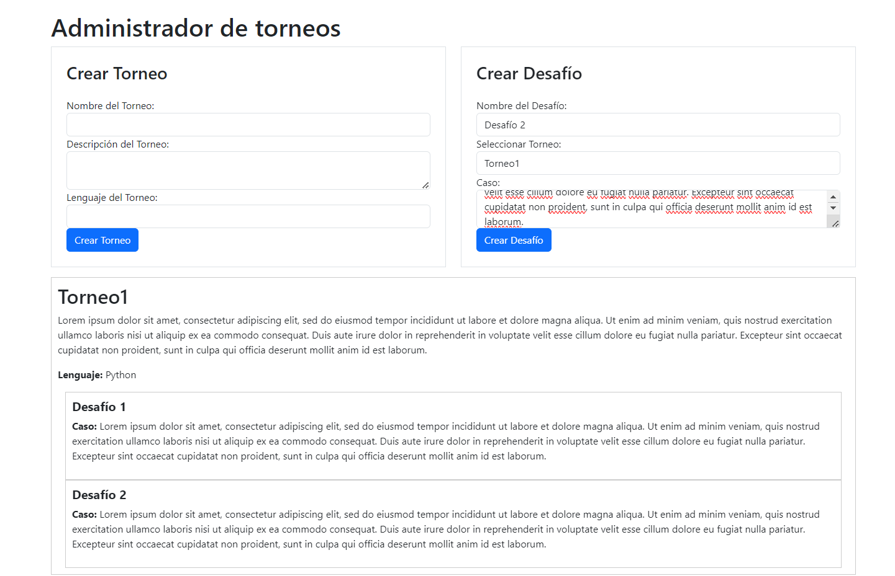
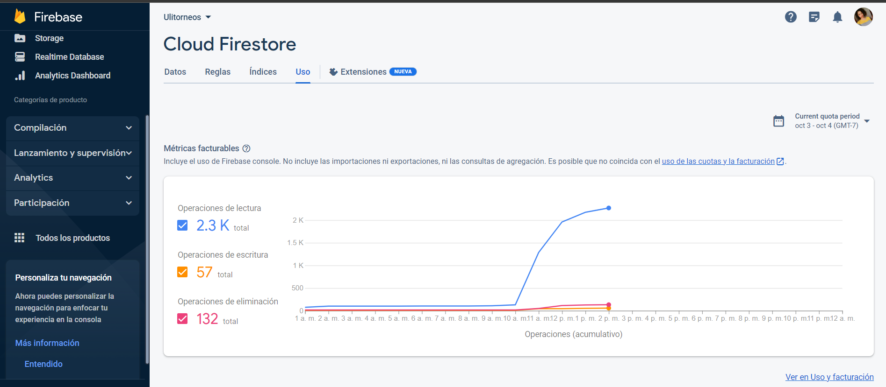
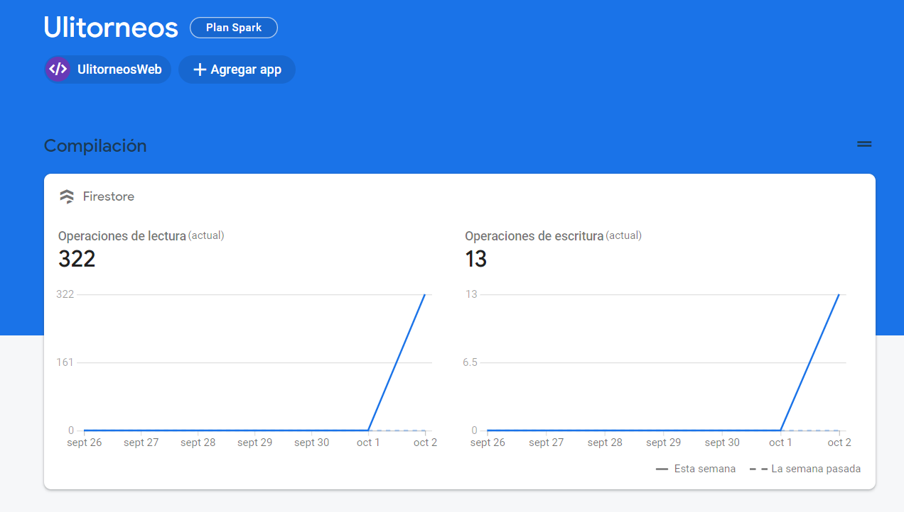

# API Management
* Estudiante: Lelis Atencia
* Proyecto Grupal: Online Judge - Ulitorneos
## 1. Desarrollo Conceptual
API Management es una herramienta esencial para gestionar y controlar eficazmente las interacciones entre sistemas informáticos, como Ulitorneos, una plataforma en línea para la organización de hackathones. Permite a las entidades organizadoras y participantes acceder a los recursos de manera eficiente y a un costo optimizado. Además de facilitar la comunicación entre los usuarios y la plataforma, el API Management desempeña un papel crucial en la gestión de accesos y costos.

En el caso de Ulitorneos, cobra a las entidades organizadoras según un modelo de negocio que incluye un costo fijo junto con un costo variable basado en la cantidad de datos utilizados (medido en megabytes). Esta estrategia se adapta a la naturaleza no frecuente de los torneos organizados por los clientes.

El API Management permite supervisar y controlar el acceso a la base de datos de Firestore, que es esencial para recopilar datos y métricas facturables. Al utilizar esta pestaña de Firestore, Ulitorneos puede rastrear y calcular de manera óptima los costos que se cobrarán a los clientes, asegurando así una gestión eficaz de los recursos y una facturación precisa. En resumen, el API Management en Ulitorneos es una herramienta fundamental que garantiza la eficiencia en la gestión de accesos y costos para todos los usuarios de la plataforma.

## 2. Consideraciones Técnicas
La plataforma Ulitorneos es una página web que establece conexiones con una base de datos a través de una API que se comunica con Firestore Database. En este contexto, estamos utilizando la versión gratuita de Firestore Database, que presenta ciertas limitaciones en cuanto al número de solicitudes permitidas. A pesar de estas restricciones, la capacidad proporcionada por la versión gratuita es adecuada para nuestras necesidades actuales.

A medida que la plataforma crece y atrae a más entidades organizadoras de torneos y participantes, es esencial evaluar cómo escalaremos la infraestructura técnica para manejar un mayor volumen de usuarios y datos. Esto podría implicar la necesidad de migrar a planes de Firestore Database más avanzados o implementar estrategias de caché y optimización de consultas para garantizar un rendimiento óptimo y una experiencia fluida para los usuarios, a medida que se incrementa la carga en el sistema.

### 2.1. Configuración de Servicio
La instalación y configuración de Ulitorneos involucra varios pasos esenciales para su funcionamiento adecuado:

**1. Desarrollo de la Página Web**: La plataforma se ha construido utilizando HTML, Bootstrap y JavaScript, lo que proporciona la interfaz de usuario y la experiencia de usuario. Estos componentes front-end permiten a los usuarios interactuar de manera eficiente con la plataforma.

**2. Firestore Database**: Se ha creado una base de datos en Firestore Database, que actúa como el repositorio principal para almacenar y recuperar datos relacionados con los torneos y los usuarios de Ulitorneos.

**3. Configuración de Credenciales en Firestore**: Para permitir que la página web realice solicitudes GET y POST a Firestore Database, se han habilitado y configurado credenciales de autenticación.

**4. Configuración de Credenciales de la API en el Script de la Página Web:**
Para asegurar que la página web de Ulitorneos pueda realizar solicitudes a Firestore Database de manera segura y autorizada, se requiere la configuración de credenciales de la API. Estos son los pasos esenciales involucrados en este proceso:

**5. Solicitudes en la Plataforma**: Una vez que se realizan solicitudes reales en la plataforma por parte de los usuarios (ya sean entidades organizadoras de torneos o participantes), se generan datos y métricas en Firestore Database. Estas métricas son esenciales para evaluar el uso y la eficacia de la plataforma.

**6. Métricas Facturables**: Las métricas facturables son fundamentales para la gestión de costos y la facturación a los clientes. Estas métricas pueden incluir datos como la cantidad de solicitudes realizadas, el volumen de datos transferidos o cualquier otro parámetro que influya en el costo de operación de la plataforma.

**7. Gestión de Costos**: Con base en las métricas facturables y utilizando el API Management mencionado anteriormente, se calcula de manera precisa la cantidad de dinero que se cobrará a los clientes. Esto garantiza que los costos reflejen de manera justa el uso de la API y los recursos de Firestore Database por parte de los clientes.

### 2.2. Primeros pasos

**1. Acceso al Panel de API Management:**

El primer paso implica la autenticación en la cuenta de Ulitorneos, seguida de la apertura del panel de API Management. Este panel constituye el punto de partida para evaluar el uso de los recursos disponibles en la plataforma.

**2. Exploración de Métricas Facturables:**

Dentro del panel de API Management, se presenta la oportunidad de examinar las métricas facturables disponibles. Estas métricas incluyen información sobre la cantidad de solicitudes realizadas a la API, el volumen de datos transferidos y el tiempo de respuesta de las solicitudes, entre otros datos relevantes.

**3. Análisis de Datos y Tendencias:**

La siguiente etapa implica el análisis exhaustivo de los datos recopilados a través de las métricas facturables. Esto incluye la identificación de tendencias, patrones, y momentos de actividad destacados. Este análisis contribuye a comprender cómo los usuarios interactúan con la plataforma.

**4. Optimización de Recursos y Costos:**

La colaboración estrecha con el equipo técnico es esencial para la optimización de los recursos y la minimización de los costos. Las métricas facturables proporcionan información valiosa para tomar decisiones informadas acerca de ajustes en recursos, estrategias de almacenamiento en caché y mejoras en el rendimiento general.

**5. Gestión de Facturación y Precios Justos:**

Las métricas facturables son la base para calcular con precisión los costos de uso de la API. Esto permite que se establezcan precios justos para los clientes de Ulitorneos, basados en el valor y la eficiencia de la plataforma.

**6. Comunicación con los Clientes:**

Por último, las métricas facturables pueden utilizarse como herramienta de comunicación con los clientes, proporcionándoles informes detallados sobre su uso de la plataforma y cómo esto se refleja en sus costos. Esta transparencia fortalece la confianza y la satisfacción del cliente.

## 3. Demo
### 3.1. Escenario práctico
En el caso de Ulitorneos, un analista utiliza el API Management para gestionar eficazmente los recursos y costos de la plataforma. Tras notar un aumento del 30% en las solicitudes a la API en tres meses, se enfoca en picos de actividad del 20% los fines de semana. Trabaja con el equipo técnico para implementar una estrategia de almacenamiento en caché, reduciendo la carga de la base de datos en un 15% durante estos picos. Además, proporciona informes mensuales a los clientes, explicando su uso promedio de 500 MB de datos por evento y costos justos. Este enfoque basado en datos garantiza la eficiencia y la satisfacción del cliente en Ulitorneos.
### 3.2. Pasos para la demo
* Primero, se hace Inicio de sesión
  
  
* Segundo, realiza solicitudes en la página web para generar actividad. 
  
* Luego, accede a los gráficos de Firestore para analizar métricas facturables como solicitudes al API.
  
  
### 3.3. Resultados
Gracias al uso efectivo del API Management y las métricas facturables, el equipo de Ulitorneos logra optimizar los recursos, reducir costos innecesarios y mantener a los clientes satisfechos. Esto asegura la eficiencia operativa y el éxito continuo de la plataforma en la organización de hackathones.

* En el siguiente video se aprecia la demo:

