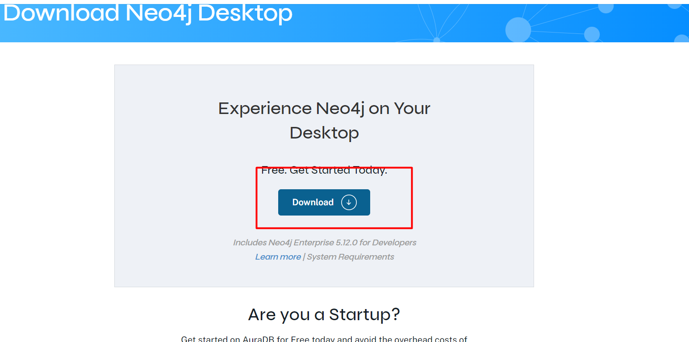
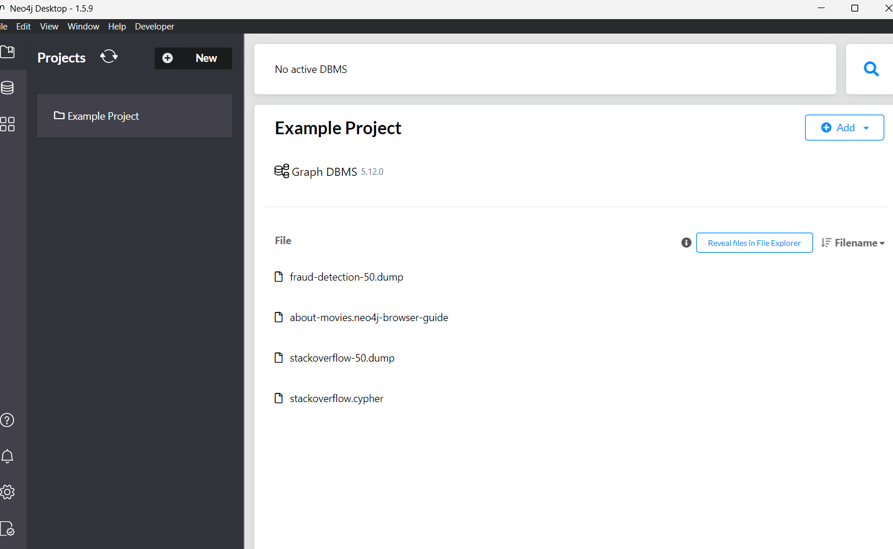
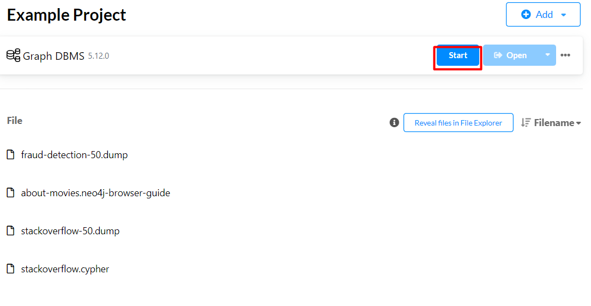
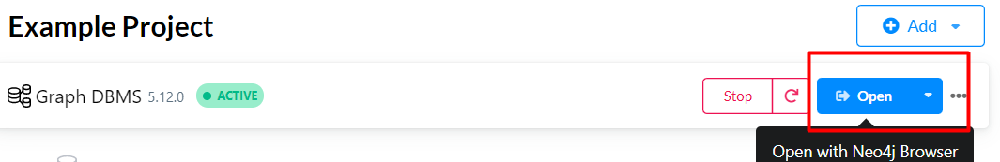
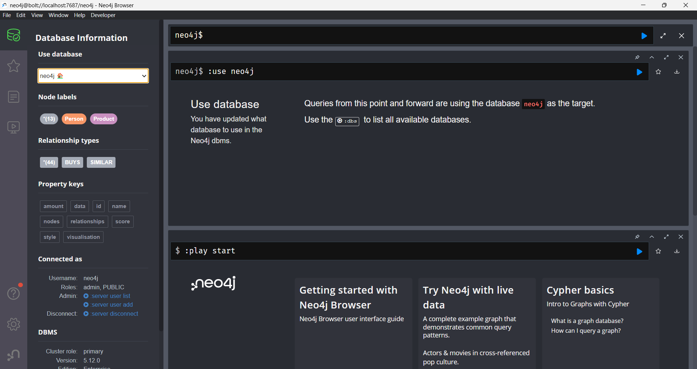
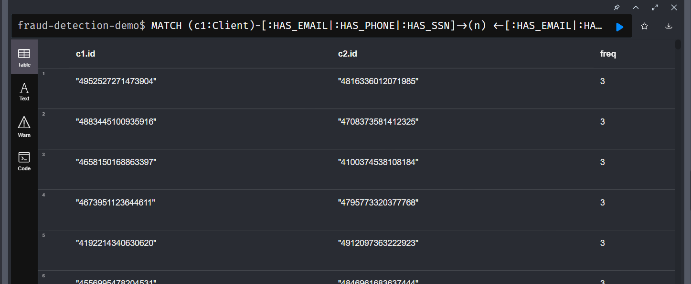
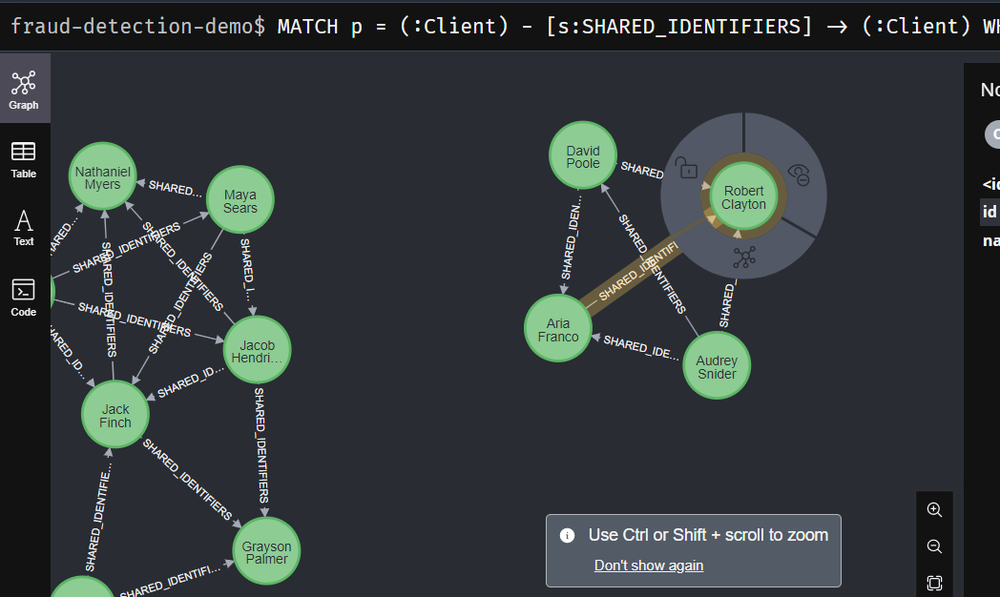
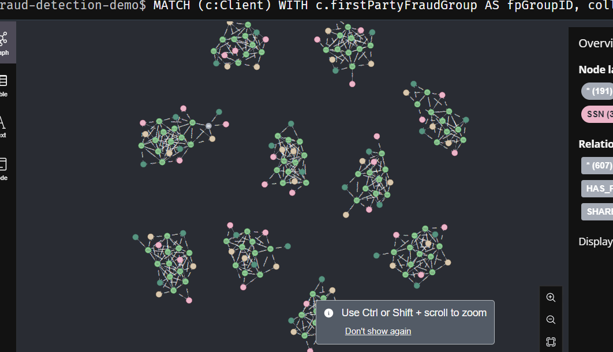

# Tema / alumno

Base de datos orientado a grafos / Javier Enrique Olazábal Silva

# Desarrollo conceptual 
En el mundo de la gestión de datos, las bases de datos desempeñan un papel fundamental, y en la actualidad, existen diversas alternativas para abordar los distintos desafíos que surgen al trabajar con datos. Dos categorías amplias de bases de datos han ganado notoriedad en los últimos años: las bases de datos relacionales y las bases de datos NoSQL. Mientras que las bases de datos relacionales siguen siendo una opción robusta para muchas aplicaciones, las bases de datos NoSQL han surgido como una respuesta versátil y eficaz para una variedad de casos de uso.

Dentro del mundo de las bases de datos NoSQL, encontramos varios modelos de datos, cada uno diseñado para abordar diferentes necesidades. Entre estos modelos, destacan el modelo clave-valor, el modelo documental, el modelo de series de tiempo y, por supuesto, los modelos orientados a grafos.

Las bases de datos orientadas a grafos son especialmente interesantes debido a su enfoque en la representación y gestión de datos altamente interconectados. Estas bases de datos se basan en un modelo que aprovecha la estructura de grafos, compuesta por vértices (también conocidos como nodos) y aristas (las conexiones entre los nodos). Este modelo resulta idóneo cuando se trata de modelar datos en los que las relaciones son tan importantes como las entidades mismas.

En un grafo, los vértices representan entidades o elementos individuales, y las aristas representan las relaciones entre estos elementos. Cada vértice puede tener propiedades asociadas que almacenan información específica sobre ese elemento. Además, los vértices se pueden etiquetar para indicar su tipo, lo que facilita la organización y búsqueda de datos en el grafo. Es importante mencionar que, a menudo, los términos "vértices" y "nodos" se utilizan indistintamente para referirse a estas entidades.

Las aristas, por otro lado, almacenan información sobre la relación entre dos vértices. Al igual que los vértices, las aristas pueden tener propiedades que describan detalles adicionales sobre la conexión. Esto permite la representación de datos complejos en un formato gráfico intuitivo.

Cuando se combinan los vértices, las aristas y sus propiedades, se forma un grafo completo. Este grafo es una representación efectiva y flexible de datos interconectados. Las consultas en bases de datos orientadas a grafos pueden aprovechar esta estructura para buscar y analizar relaciones de manera eficiente, lo como es especialmente útil en aplicaciones como redes sociales, sistemas de recomendación, análisis de rutas y muchas otras áreas.

En resumen, las bases de datos NoSQL orientadas a grafos ofrecen una poderosa herramienta para gestionar y analizar datos altamente interconectados. Su modelo de grafos, que se basa en vértices, aristas y propiedades, permite una representación rica y flexible de datos, lo que las hace ideales para una variedad de aplicaciones donde las relaciones son cruciales. Estas bases de datos continúan siendo una opción importante en el panorama de la gestión de datos, proporcionando una solución efectiva para problemas complejos y entrelazados en el mundo moderno de la información.
# Consideraciones técnicas

En esta sección consideraremos los aspectos técnicos que se debe llevar para poder realizar la instalación del servicio. 

## Instalación / configuración de servicio

Existen diferentes motores de bases de datos orientados a grafos dentro del mercado, por lo que para esta explicación hemos considerado **Neo4j** debido a que su implementación es mucho más fácil e intuitiva. Además, Neo4j tiene su propio lenaguaje de consultas denominado Cypher. 


## Primeros pasos 

### 1. Instalación de Neo4j Desktop

La instalación del motor de Neo4j se puede realizar a través de el siguiente [enlace](https://neo4j.com/download/) 

Donde la instalación es bastante fácil a través de un ejecutable. 

### 2. Creación de base de datos 
Una vez instalado el entorno desktop, podemos abrir la aplicación, en donde se abrirá un entorno similar a este. 


Acá podemos utilizar la base de datos de prueba que nos brinda el mismo entorno, y podemos ejecutarlo.



### 3. Abrir entorno de consultas

Una vez ejecutado podemos abrir el entorno de consultas que tiene. 



Cuando se abre, visualizaremos esta interfaz; que nos pertmitirá hacer las consultas necesarias utilizando cypher. 



# Demo 
Para esta demo se ha utilizado un ejemplo de base de datos de prueba de detección de fraude. Con esta base de datos vamoa a realizar analítica predictiva aprovechando las ventajas que nos brinda Neo4j para este aspecto con la librería de GDS.  

## Escenario práctico 

El escenario, es la detección de información personal dentro de cada nodo. 

## Pasos para la demo 

### 1. Instalación de la base de datos

La base de datos se encuentra en el siguiente [enlace](https://github.com/neo4j-graph-examples/fraud-detection/tree/main/data), es un archivo .dump 

### 2. Ejecutar las consultas. 

Las consultas realizadas están en la carpeta [scripts](./scripts/fraud-detection.cypher)

1. En primer lugar analizamos cuales son los nodos que están compartiendo información entre ellos. 

1. Creamos esta relación en el grafo

1. Ejecutamos el algoritmo de grafos 
```cypher
CALL gds.graph.project('wcc',
    {
        Client: {
            label: 'Client'
        }
    },
    {
        SHARED_IDENTIFIERS:{
            type: 'SHARED_IDENTIFIERS',
            orientation: 'UNDIRECTED',
            properties: {
                count: {
                    property: 'count'
                }
            }
        }
    }
) YIELD graphName,nodeCount,relationshipCount,projectMillis;

```
2. Creamos la relación en base al algoritmo
```cypher
CALL gds.wcc.stream('wcc',
    {
        nodeLabels: ['Client'],
        relationshipTypes: ['SHARED_IDENTIFIERS'],
        consecutiveIds: true
    }
)
YIELD componentId, nodeId
WITH componentId AS cluster, gds.util.asNode(nodeId) AS client
WITH cluster, collect(client.id) AS clients
WITH cluster, clients, size(clients) AS clusterSize WHERE clusterSize > 1
UNWIND clients AS client
MATCH (c:Client) WHERE c.id = client
SET c.firstPartyFraudGroup=cluster;

```

3. Mostramos los grafos dentro



## Resultados 

Los resultados que se obtuvieron, fueron que la utilización de librerías de análisis de datos utilizando neo4j es bastante util e intuitivo, además nos brinda una gran facilidad debido al modelo de datos de grafos. 

# Referencias


Video de [demo](https://drive.google.com/file/d/1Ip_4U6X5FKiT4KaWyrvZsQ5dlPtHutMb/view?usp=sharing) y [explicacion](https://drive.google.com/file/d/1ItDAs4KHf37wKcgqOb5njsP27QhyGz2E/view?usp=sharing)