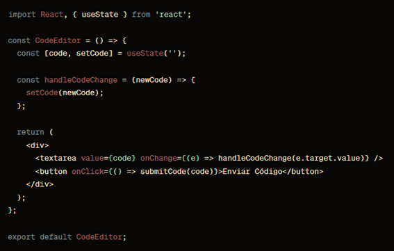
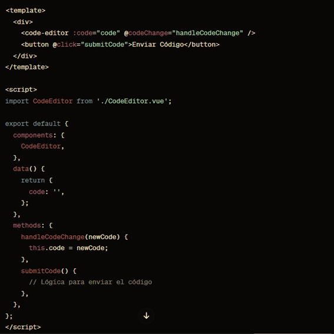
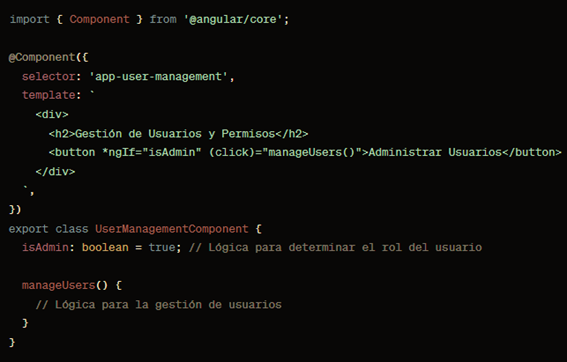

# Comparación de Frameworks Front End: React vs Vue vs Angular
* Estudiante: Lelis Atencia
* Proyecto Grupal: Online Judge - Ulitorneos
## PROYECTO GRUPAL: ONLINE JUDGE – ULITORNEOS

## 1. Desarrollo Conceptual
### 1.1. Conceptos:
La elección del framework front-end es crucial para proporcionar una experiencia de usuario eficiente en Ulitorneos. Cada framework tiene sus propios conceptos, como componentes, estado y directivas, que afectarán la estructura y la forma en que se desarrolla la interfaz de usuario.

### 1.2. Escenario de Uso Vital:
En el contexto de Ulitorneos, la vitalidad de la elección del framework radica en su capacidad para manejar la complejidad de la plataforma, permitir la escalabilidad y proporcionar una interfaz de usuario intuitiva para entidades organizadoras y participantes.

## 2. Consideraciones Técnicas
### Evaluación de Escalabilidad:
Cada framework tiene en cuenta la escalabilidad de manera diferente. React es conocido por su flexibilidad y capacidad de escalabilidad, Vue ofrece una curva de aprendizaje suave y Angular proporciona una estructura completa y opinionada. La elección dependerá de cómo Ulitorneos planifica su crecimiento.
### Importancia Técnica:
La interacción con Firestore Database y la necesidad de gestionar métricas facturables implican que la elección del framework debe alinearse con las consideraciones técnicas específicas de Ulitorneos, garantizando la eficiencia en las operaciones.

### 2.1. Configuración de Servicio
La instalación y configuración de Ulitorneos involucra varios pasos esenciales para su funcionamiento adecuado:

**1. Elección del Framework:** La instalación y configuración de Ulitorneos involucra el desarrollo de la página web, y aquí es donde la elección del framework juega un papel crucial. React, Vue y Angular tienen diferentes enfoques y sintaxis, por lo que la elección dependerá de las preferencias del equipo y los requisitos del proyecto.

**2. Adaptación a la Página Web:** Cada framework tiene su manera única de adaptarse a la página web de Ulitorneos. React utiliza JSX, Vue utiliza plantillas y directivas, mientras que Angular utiliza TypeScript y módulos.

### 2.2. Primeros pasos

**1. Escenario de Acceso al Panel:**

Cuando los desarrolladores dan los primeros pasos, la elección del framework influye en cómo acceden y utilizan el panel de desarrollo. React con su enfoque declarativo, Vue con su simplicidad y Angular con su estructura organizada tendrán diferentes flujos de trabajo.

**2. Exploración de Herramientas y Características:**

Cada framework viene con sus propias herramientas y características. React tiene una amplia comunidad y una rica colección de bibliotecas, Vue ofrece una integración progresiva y Angular proporciona un conjunto completo de herramientas desde el principio. La elección dependerá de las necesidades específicas de Ulitorneos.

**3. Escenario de Colaboración con el Equipo de Desarrollo:**

La colaboración con el equipo de desarrollo es esencial para la optimización de recursos y la gestión eficiente. La elección del framework influirá en cómo los desarrolladores colaboran, organizan el código y realizan mejoras continuas en Ulitorneos.

**4. Adaptación a la Evolución de la Plataforma:**

La evolución de Ulitorneos requerirá ajustes y mejoras continuas. React, Vue y Angular tienen diferentes enfoques de evolución y actualización. React es conocido por su gradualidad, Vue para su simplicidad en actualizaciones y Angular para su estructura planificada.
Estos elementos reflejan cómo la comparación de frameworks front-end impacta en el desarrollo de Ulitorneos. La elección del framework debe equilibrar la eficiencia en el desarrollo, la escalabilidad y la adaptabilidad a las necesidades específicas de la plataforma.

## 3. Demo
### 3.1. Escenario React:

Implementar la interfaz de usuario para el entorno de programación en línea, donde los participantes envían y visualizan código.
### Justificación:
Virtual DOM: Mejora del rendimiento al minimizar actualizaciones directas en el DOM.
* Código en jsx:
  
  

### 3.2. Escenario de Vue:
  

Desarrollar la funcionalidad de revisión de código, donde los jueces y participantes pueden ver y evaluar el código enviado.
### Justificación:
  **Simplicidad y Curva de Aprendizaje Suave:** Facilita la colaboración y comprensión del código.
* Código Html:
  
   

### 3.2. Escenario de Angular:

Gestión de usuarios y permisos, donde se definen los roles y se administra el acceso a las competiciones y datos sensibles.
### Justificación:
**Estructura Completa y Opinionada:** Proporciona una estructura más completa y opinionada.
* Código typescript
  
   
