# Stress Testing

## 1. Desarrollo Conceptual
La prueba de estrés de software es una técnica de prueba de software que determina qué tan sólido o robusto es un software, al realizar pruebas que lo llevan más allá de los límites de una operación normal. Es decir, se brindan condiciones desfavorables al sistema y se ve su desempeño en tales condiciones.

Estas pruebas de software se suelen realizar para medir la estabilidad, confiabilidad, robustez y capacidad de manejo de errores de nuestro sistema; con el objetivo de tener la certeza de que el sistema no colapsará o crasheará ante situaciones límite.

* Otros sinónimos son: prueba de carga, prueba de resistencia, prueba de tortura.

Antes de ahondar más en el tema, entendamos primero qué tipo se prueba de software son las pruebas de estrés.
#### Tipos de pruebas de software
Dentro del grupo que conforma las pruebas de software, el Stress Testing se encuentra dentro de la categoría de Pruebas manuales, siendo una prueba de caja negra de tipo no funcional, dentro del subgrupo de Pruebas de Rendimiento. Esto se puede visualizar mejor en el siguiente diagrama:

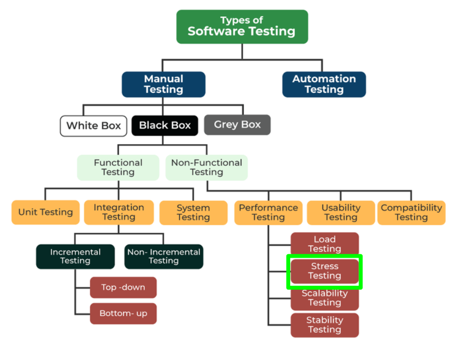

### 1.2. Tópicos importantes
#### ¿En qué casos puedo necesitar realizar pruebas de estrés?
* Para ajustarse en casos donde haya un pico repentino de tráfico
* Mostrar mensajes de error pertinentes en condiciones de estrés
* El sistema funciona en condiciones anormales
* Preparación para condiciones de estrés
#### ¿Cuál es el propósito de la prueba de estrés?
* Analizar el comportamiento de la aplicación tras un fallo
* Recuperación del sistema tras un fallo
* Dar a conocer problemas de hardware y corrupción de datos
* Descubrir vulnerabilidades en la seguridad
* Garantizar la seguridad de los datos
### 1.3 Tipos de pruebas de estrés
#### A. Distribuida:
Se realizan pruebas de estrés en modo servidor-cliente. Es decir, se hacen las pruebas en todos los clientes pretenecientes a un mismo servidor.
#### B. Aplicación/Producto
Se realizan pruebas en un producto de software, con el objetivo de encontrar defectos relacionados al bloqueo de datos, problemas de red y congestión.
#### C. Transaccional
Se realizan pruebas en las transacciones entre dos o más aplicaciones para realizar ajustes y optimizaciones al sistema.
#### D. Sistemático
Se realizan pruebas a través de múltiples sistemas corriendo en un mismo servidor. tiene el objetivo de descubrir defectos en donde los datos de una aplicación bloquea a otra aplicación.
#### E. Analítico/Exploratorio
Se realizan pruebas en un sistema con parámetros anormales o que no ocurrirían en un escenario real. Se suele hacer para encontrar defectos en escenarios inusuales, como una gran cantidad de usuarios ingresando al mismo tiempo.
### 1.4. Ventajas y desventajas
| Ventajas        | Desventajas     |
|-----------------|-----------------|
| Determina el comportamiento del sistema después de un fallo y asegura su pronta recuperación. | Las pruebas de estrés manuales son complicadas, porque requieren de bastante tiempo para que sean completadas, y en sí, el proceso es complicado. |
| Asegura que los fallos no causen problemas de seguridad | Requiere de un buen conocimiento de scripteo, para implementar los casos de prueba en una herramienta en específico. Si no se hace correctamente, pueden presentarse fallos y resultar en una pérdida de tiempo y recursos. |
| Hace que funcione en cualquier situación, ya sean condiciones normales o anormales, de una manera apropiada. | Algunas herramientas de pago suelen cobrar más de lo normal. |
### 1.5. Proceso del Stress Testing
* Planeamiento: En donde se analiza el sistema, se recopilan los datos y se definen los objetivos de la prueba a realizar.
* Scripts de automatización: Luego se procede a crear los scripts de automatización y se generan los datos de las pruebas para los escenarios de prueba definidos
* Ejecución de las pruebas: Después, Se ejecutan los scripts para las pruebas
* Monitoreo: También, se hace un monitoreo, viendo el desempeño de las pruebas y se recopilan los resultados.
* Análsis de resultados: Luego se analizan estos resultados, en busca de cuellos de botella.
* Ajustes y optimización: Y por ultimo, se procede a modificar el código, buscando que el sistema pueda permitirse los nuevos estándares definidos.
### 1.6. Herramientas de Stress Testing
Algunas de las herramientas más importantes del mercado y que permiten realizar pruebas de carga, así como pruebas de estrés entre otras tareas.
* JMeter [(Link)](https://jmeter.apache.org)
* LoadNinja [(Link)](https://loadninja.com)
* WebLoad [(Link)](https://www.radview.com/webload-download/)
* NeoLoad [(Link)](https://www.tricentis.com/products/performance-testing-neoload)
* SmartMeter [(Link)](https://www.smartmeter.io)

## 2. Consideraciones Técnicas
A contiunuacion, procederemos a realizar la instalación y configuración de Apache JMeter para un caso de prueba, para lo cual, hay que tener ciertas consideraciones dentro de nuestro sistema. La instalación se realizará en un SO Windows 11 de 64 bits.
### 2.1. Instalación / Configuración de Servicio
Dirigirse a la web de [(JMeter)](https://jmeter.apache.org). Como se puede observar, se menciona es necesario tener Java SE JDK 8+, por lo cual, también accedemos a la web de descargas de [(Java)](https://www.oracle.com/pe/java/technologies/javase/javase8-archive-downloads.html) y descargarmos la versión apropiada para nuestro sistema. En el caso de este ejemplo, se descargará Java SE Development Kit 8u202 (la última versión presente hasta la fecha) para Windows 11 de 64 bits (Windows x64).

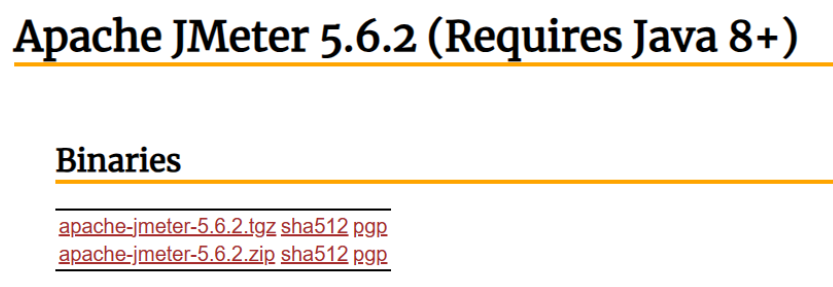

En la web de [(JMeter)](https://jmeter.apache.org), procedemos a la sección Downloads y descargamos el archivo ".zip". Una vez descargados ambos archivos, procedemos a instalar primero el Java y después el JMeter como cualquier aplicación común y corriente.

Ahora, tenemos que configurar las variables de entorno de nuestro sistema. Para esto, tenemos que dirigirnos al Panel de Control, buscándolo en el menú de Windows. Se abrirá una ventada del Panel de Control, en donde debemos acceder a "Sistema y Seguridad" y luego a "Sistema".

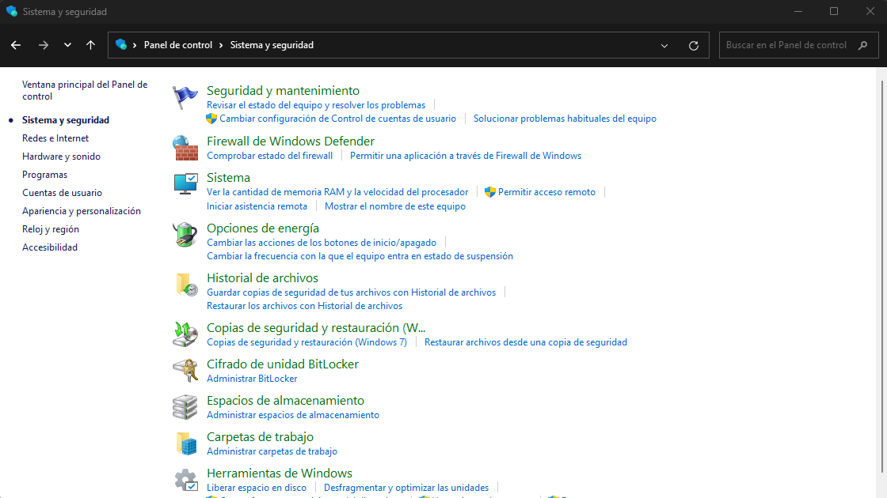

Se nos abrirá una nueva ventana. Aquí, deberemos buscar la opción que diga "Configuración avanzada del sistema".

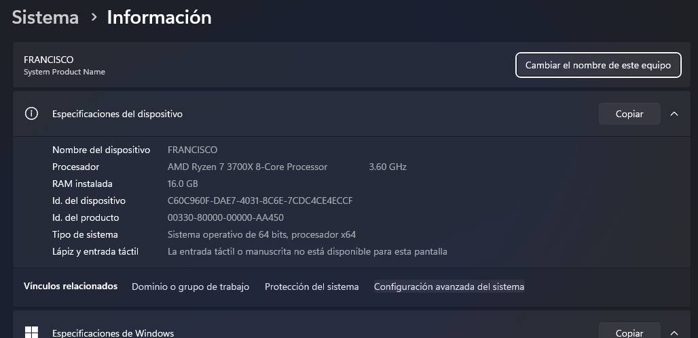

Se abrirá una nueva ventana llamada "Proipiedades del sistema", en la cual debemos hacer click en "Variables de entorno":

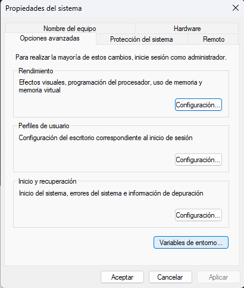

Debemos asegurarnos de que existan las siguientes variables de entorno: JAVA_HOME y JMETER_HOME, las cuales almacenan las rutas a ambas aplicaciones. Si no existen, procedemos a crearlas presionando el botón "Nueva" en la sección "Variables del sistema".

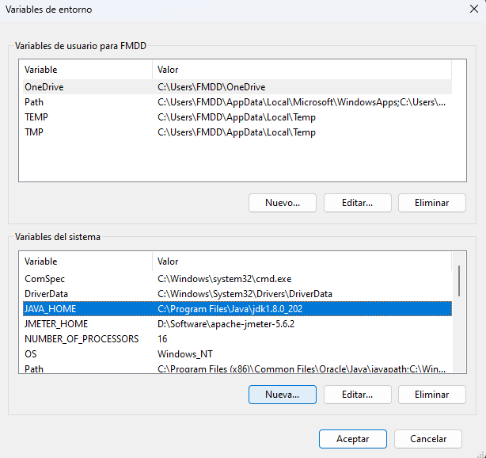

Dentro, se coloca el nombre y ruta. En el caso de JAVA_HOME, se coloca ese nombre y la ruta en donde está instalado el Java JDK. Generalmente es en "C:\Program Files\Java\jdk1.8.0_202" (para el caso de la última versión). Luego se da en "Aceptar" y se repite el proceso para la variable JMETER_HOME, colocando la ubicación en donde está instalado JMeter.

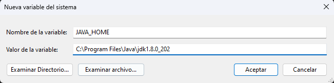

Por último, se tiene que verificar dentro de la variable "Path"

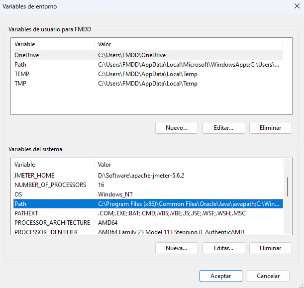

Tiene que estar definido la ruta "bin" de Java, como se muestra a continuación. Si no existe, se crea una nueva con los parámetros que se muestran en la imagen.

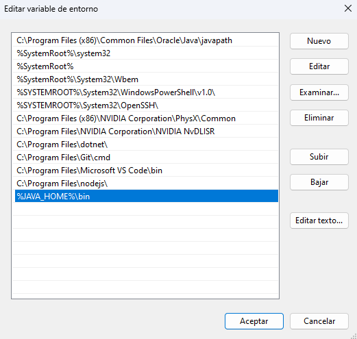

Teniendo todo lo anterior listo, ya se puede emepezar a usar la aplicación Apache JMeter.
### 2.2. Primeros pasos
Para abrir la aplicación JMeter, tenemos que dirigirnos a la carpeta en donde instalamos el JMeter. Luego, tenemos que abrir la carpeta "bin".

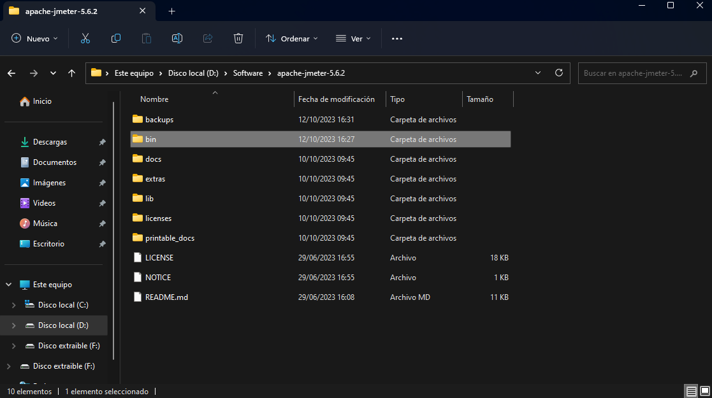

Dentro de la carpeta "bin", tenemos que buscar el ejecutable "jmeter.bat", hacemos doble click y ya tendríamos la aplicación lista para usar.

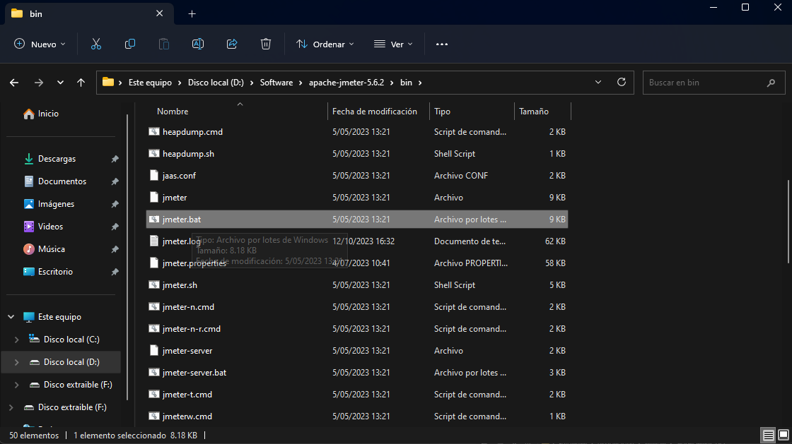

La aplicación abierta:

## 3. Demo

### 3.1. Escenario práctico

### 3.2. Pasos para la demo

### 3.3. Resultados