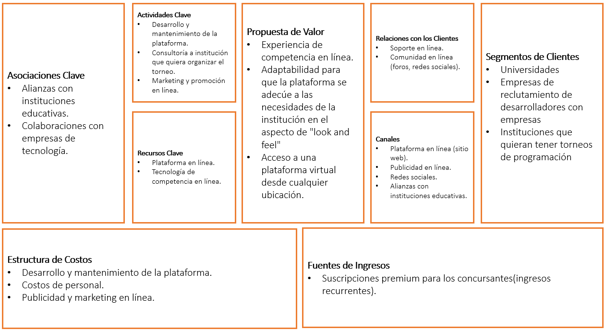

## 1. Caso de Negocio
### 1.1. Generalidades
Ulitorneos es una plataforma virtual con sede en Lima. Se dedica a ofrecer una experiencia de competencia en línea, similar a un "online judge", que permite a los participantes involucrarse en torneos de programación y desafíos similares. Su enfoque se encuentra en la virtualidad, lo que significa que opera en un entorno completamente en línea, lo que facilita la participación desde cualquier ubicación geográfica.

### 1.2. Modelo de Negocio
#### 1.2.1. Descripción
El modelo de negocio de la empresa se centra principalmente en generar ingresos a través de suscripciones premium, ofreciendo a los usuarios una versión mejorada y más completa de su plataforma o servicio a cambio de una tarifa periódica. El tipo de negocio sería B2B. Los usuarios serían las instituciones que quieran llevar a cabo los torneos.
#### 1.2.2. Objetivos del Negocio
- Desarrollar una plataforma funcional y atractiva que ofrezca la experiencia de competencia en línea.
- Probar la plataforma con un grupo inicial de usuarios para identificar posibles problemas y realizar mejoras.
- Concentrar esfuerzos en atraer los primeros usuarios y construir una base de usuarios sólida.
- Ofrecer un entorno de creacion de concursos mas el compilador de juez, asi como el uso de datos para marketing.
- Contactar a programadores destacadas en base a logros en la plataforma
#### 1.2.3. Business Model Canvas

### 1.3. Estructura del Equipo
El equipo detrás de Ulitorneos está compuesto por cuatro miembros clave. Javier lidera el proyecto, y junto a Angel, Francisco y Lelis, todos ellos desempeñan roles de desarrollo en el proyecto. Dado el tamaño reducido del equipo, no se han establecido divisiones por áreas funcionales o departamentos. La fuerza del equipo radica en su experiencia preprofesional en desarrollo de software, con competencias que abarcan lenguajes como Python, JavaScript, SQL, y más.

### 1.4. Listado de Stakeholders

|           Rol            |     Encargado     |                   Descripción                  |
|--------------------------|-------------------|----------------------------------------------|
|         Cliente          | Organizaciones | La institución organizadora que utiliza la plataforma para crear y gestionar concursos de programación. Son responsables de configurar concursos, desarrollar sus propios problemas o escoger dentro de un dataset, enviar invitaciones a los participantes y poder observar estadísticas sobre los resultados y en tiempo real de los concursos. |
|         Usuario          | Organizaciones y participantes | Los participantes en los hackathons, que pueden ser estudiantes de programación o programadores experimentados. Utilizan la plataforma para competir, enviar sus soluciones y recibir retroalimentación sobre sus códigos. |
|    Gestor de negocio     | Javier Olazabal | Encargado de la gestión estratégica y operativa de la plataforma. Definen las estrategias de crecimiento, colaboraciones y acuerdos comerciales con las instituciones organizadoras. Asegurar que las empresas se encuentren cómodos con la plataforma y obtener beneficios a través de los planes brindados a los clientes. |
| Arquitecto de software   | Lelis Atencia| Diseña la estructura de la plataforma, incluyendo la arquitectura técnica y la infraestructura necesaria para soportar la carga de trabajo. Toma decisiones técnicas clave para garantizar la escalabilidad y la eficiencia. |
| Implementador e integrador| Francisco Diaz | Responsable de desarrollar, implementar y mantener las características técnicas de la plataforma. Codifican las funcionalidades requeridas, integran sistemas externos y aseguran que todo funcione correctamente. |
| Responsable de mantenimiento| Angel Cuya | Encargado de mantener y actualizar la plataforma en funcionamiento. Esto implica la solución de problemas técnicos, la aplicación de actualizaciones de seguridad y el monitoreo constante para garantizar el rendimiento y la disponibilidad. |
|         Performance Checker         | Javier Olazabal | Supervisa y gestiona la evaluación de los códigos enviados por los participantes. Realiza pruebas de compilación y ejecución para verificar la precisión y eficiencia de las soluciones. Contribuye a la imparcialidad y calidad de la plataforma al garantizar una evaluación precisa de los outcomes de los participantes. |

