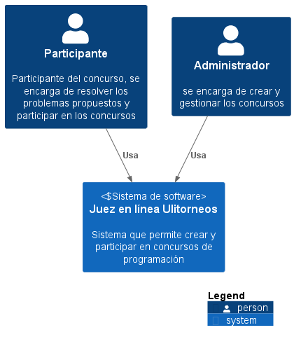
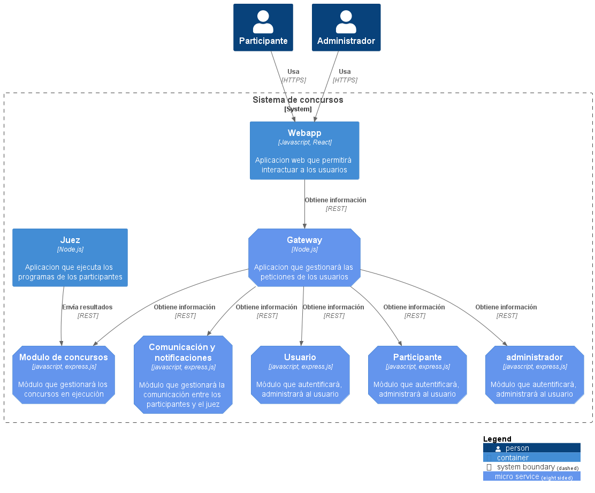
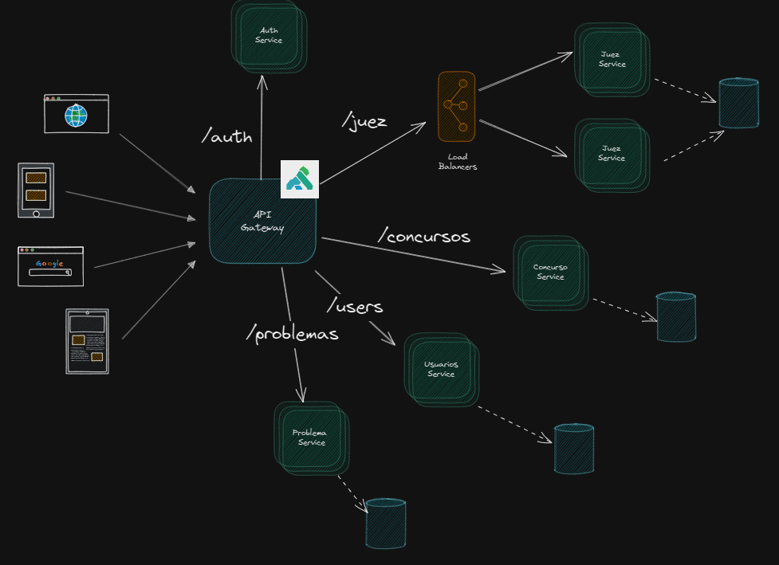

## 5. Propuesta de Arquitectura 
En esta sección se dará más detalle sobre la arquitectura del sistema donde se utilizará una nomenclatura de C4 y diagramas de despligue. 

### Diagrama de contexto(c1)

### Diagrama de contenedores(c2)

### Diagrama de componentes(c3)

### Propuesta de despligue (demo)

### Propuesta de despligue cloud

