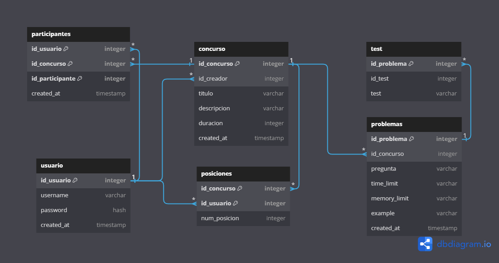
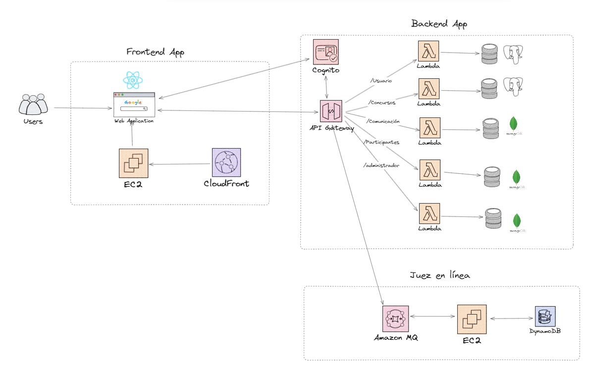

# Arquitectura de Software Grupo 02
## Integrantes
* Javier Enrique Olazábal Silva [(Itsjavito)](https://github.com/ItsJavito)
* Lelis Raquel Atencia Mondragón [(atencia22)](https://github.com/atencia22)
* Angel Cuya Sanchez [(galadto)](https://github.com/galadto)
* Francisco Manuel Díaz Delgado [(fmdd00)](https://github.com/fmdd00)

## Tema de proyecto (Juez en línea)
Para el trabajo en grupo hemos definido utilizar como tema de trabajo la arquitectura de un software como lo es un juez online, como lo es BOCA, Codeforces, UVA, etc.

## 1. Caso de Negocio
### 1.1. Generalidades
Ulitorneos es una plataforma virtual con sede en Lima. Se dedica a ofrecer una experiencia de competencia en línea, similar a un "online judge", que permite a los participantes involucrarse en torneos de programación y desafíos similares. Su enfoque se encuentra en la virtualidad, lo que significa que opera en un entorno completamente en línea, lo que facilita la participación desde cualquier ubicación geográfica.

### 1.2. Modelo de Negocio
#### 1.2.1. Descripción
El modelo de negocio de la empresa se centra principalmente en generar ingresos a través de suscripciones premium, ofreciendo a los usuarios una versión mejorada y más completa de su plataforma o servicio a cambio de una tarifa periódica. El tipo de negocio sería B2B. Los usuarios serían las instituciones que quieran llevar a cabo los torneos.
#### 1.2.2. Objetivos del Negocio
- Desarrollar una plataforma funcional y atractiva que ofrezca la experiencia de competencia en línea.
- Probar la plataforma con un grupo inicial de usuarios para identificar posibles problemas y realizar mejoras.
- Concentrar esfuerzos en atraer los primeros usuarios y construir una base de usuarios sólida.
- Ofrecer un entorno de creacion de concursos mas el compilador de juez, asi como el uso de datos para marketing.
- Contactar a programadores destacadas en base a logros en la plataforma
#### 1.2.3. Business Model Canvas

##### Segmentos de Clientes:
- Universidades
- Empresas de reclutamiento de desarrolladores con empresas 
- Instituciones que quieran tener torneos de programación.

##### Propuesta de Valor:
- Experiencia de competencia en línea.
- Adaptabilidad para que la plataforma se adecúe a las necesidades de la institución en el aspecto de "look an feel"
- Acceso a una plataforma virtual desde cualquier ubicación.

##### Canales:
- Plataforma en línea (sitio web).
- Publicidad en línea.
- Redes sociales.
- Alianzas con instituciones educativas.

##### Relaciones con los Clientes:
- Soporte en línea.
- Comunidad en línea (foros, redes sociales).

##### Fuentes de Ingresos:
- Suscripciones premium para los concursantes(ingresos recurrentes).

##### Recursos Clave:
- Plataforma en línea.
- Tecnología de competencia en línea.

##### Actividades Clave:
- Desarrollo y mantenimiento de la plataforma.
- Consultoría a institución que quiera organizar el torneo.
- Marketing y promoción en línea.

##### Asociaciones Clave:
- Alianzas con instituciones educativas.
- Colaboraciones con empresas de tecnología.

##### Estructura de Costos:
- Desarrollo y mantenimiento de la plataforma.
- Costos de personal.
- Publicidad y marketing en línea.

### 1.3. Estructura del Equipo
El equipo detrás de Ulitorneos está compuesto por cuatro miembros clave. Javier lidera el proyecto, y junto a Angelo, Francisco y Lelis, todos ellos desempeñan roles de desarrollo en el proyecto. Dado el tamaño reducido del equipo, no se han establecido divisiones por áreas funcionales o departamentos. La fuerza del equipo radica en su experiencia preprofesional en desarrollo de software, con competencias que abarcan lenguajes como Python, JavaScript, SQL, y más.

### 1.4. Listado de Stakeholders

|           Rol            |     Encargado     |                   Descripción                  |
|--------------------------|-------------------|----------------------------------------------|
|         Cliente          | Organizaciones | La institución organizadora que utiliza la plataforma para crear y gestionar hackathons. Son responsables de configurar competencias, establecer reglas y proporcionar desafíos a los participantes. |
|         Usuario          | Organizaciones y participantes | Los participantes en los hackathons, que pueden ser estudiantes de programación o programadores experimentados. Utilizan la plataforma para competir, enviar sus soluciones y recibir retroalimentación sobre sus códigos. |
|    Gestor de negocio     | Javier Olazabal | Encargado de la gestión estratégica y operativa de la plataforma. Definen las estrategias de crecimiento, colaboraciones y acuerdos comerciales con las instituciones organizadoras. Aseguran que la plataforma satisfaga las necesidades de los clientes. |
| Arquitecto de software   | Lelis Atencia| Diseña la estructura de la plataforma, incluyendo la arquitectura técnica y la infraestructura necesaria para soportar la carga de trabajo. Toma decisiones técnicas clave para garantizar la escalabilidad y la eficiencia. |
| Implementador e integrador| Francisco Diaz | Responsable de desarrollar, implementar y mantener las características técnicas de la plataforma. Codifican las funcionalidades requeridas, integran sistemas externos y aseguran que todo funcione correctamente. |
| Responsable de mantenimiento| Angel Cuya | Encargado de mantener y actualizar la plataforma en funcionamiento. Esto implica la solución de problemas técnicos, la aplicación de actualizaciones de seguridad y el monitoreo constante para garantizar el rendimiento y la disponibilidad. |
|         Performance Checker         | Javier Olazabal | Supervisa y gestiona la evaluación de los códigos enviados por los participantes. Realiza pruebas de compilación y ejecución para verificar la precisión y eficiencia de las soluciones. Contribuye a la imparcialidad y calidad de la plataforma al garantizar una evaluación precisa de los outcomes de los participantes. |

## 2. Requerimientos del Sistema

### 2.1. Requerimientos Funcionales
#### Requerimientos funcionales de usuario genérico

| Identificador | Descripción                                       |
|---------------|---------------------------------------------------|
| US01          | Registro de usuario: Como usuario, quiero poder crear una cuenta nueva, con un correo, usuario y una contraseña, para acceder a la plataforma. También poder crear la cuenta utilizando los servicios de Google para mayor facilidad. |
| US02          | Inicio de sesión: Como usuario, quiero poder ingresar al sistema con los datos de usuario que registré, para poder acceder a las funciones de la plataforma. |
| US03          | Modificar datos personales: Como usuario, quiero poder modificar mi nombre de usuario, contraseña y el país, para tener mis datos siempre actualizados. |
| US04          | Cerrar sesión: Como usuario, quiero poder cerrar mi sesión del sistema, para dar por culminado mi trabajo. |

#### Requerimientos funcionales del participante

| Identificador | Descripción                                       |
|---------------|---------------------------------------------------|
| US05          | Visualizar problemas: Como participante, quiero poder visualizar el nombre y la descripción de los problemas que puedo resolver, para conocer los detalles de estos. |
| US06          | Subir solución: Como participante, quiero seleccionar un problema y subir los archivos de código fuente, para presentar una solución. |
| US07          | Visualización del tiempo del concurso: Como participante, quiero poder ver el tiempo restante del concurso, para poder organizarme de la mejor manera. |
| US08          | Visualizar resultados: Como participante, quiero poder visualizar la información de los problemas y las respectivas soluciones que presenté, así como el tiempo que tomé, el lenguaje utilizado y la respuesta por parte del juez, para seguir el récord de mis soluciones presentadas. |
| US09          | Visualizar puntajes globales: Como participante, quiero poder ver los puntajes a nivel global de otros participantes que han presentado sus soluciones, con datos como el nombre de participante, el país, el instituto, los problemas que ha resuelto y el puntaje total, para hacer un seguimiento del progreso de otros participantes. |

#### Requerimientos funcionales del cliente

| Identificador | Descripción                                      |
|---------------|---------------------------------------------------|
| US10          | Como cliente, quiero poder crear mi concurso de programación con la cantidad de participantes, el tiempo del concurso, las fechas límites del concurso y las características como los títulos, descripciones, etc. |
| US11          | Como cliente, debería poder subir los problemas para el concurso que he creado junto a sus casos de prueba y los límites que este necesita. |
| US12          | Como cliente, debería poder modificar una vez creado el concurso, tanto como el título, la cantidad de participantes, las fechas, los límites, etc. |
| US13          | Como cliente, debería poder modificar los problemas creados junto a los límites y las características del problema. |
| US14          | Como cliente, debería poder personalizar el entorno de mis torneos. |
| US15          | Como cliente, debería poder solicitar soporte ante alguna incidencia o duda. |
| US16          | Como cliente, debería poder solicitar una reunión para hacer solicitudes según mis requerimientos con alguien de auditoría |
| US17          | Como cliente, debería poder actualizar o cancelar mi suscripción. |
| US18          | Como cliente, debería poder crear una prueba personalizada para la persona (posible empleado) que evalúo que pueda ser resuelta en cualquier horario |

<!-- #### (POR EVALUAR) Requerimientos funcionales del Administrador

| Identificador | Descripción                                       |
|---------------|---------------------------------------------------|
| US18          | Administración de cuentas: Como administrador del sistema, quiero poder habilitar las nuevas cuentas de usuario o deshabilitar las ya existentes, para controlar el acceso al sistema y mantener la seguridad. |
| US19          | Soporte/Atención de consultas: Como administrador, quiero poder recibir mensajes sobre problemas técnicos, así como otras consultas, para resolver los problemas que tengan los usuarios. |
| ...          | ... | -->

---
<!-- #### // Requerimientos por evaluar: Existen otras funcionalidades nuestras plataformas modelo ofrecen y que se necesitan evaluar para su implementación en la nuestra. Como usuario del sistema, existen opciones realizar clarificaciones respecto a un problema, ver tastks y realizar backups. Como administrador del sistema, se pueden crear y modificar los datos de competencias, ver logs, reportes, los usuarios en una competencia, entre otros. // -->

### 2.2. Flujo de Interacción con la Plataforma Ulitorneos: (Flujo principal)

#### 2.2.1. Flujo de interacción del usuario

1. El usuario accede a la página de inicio de Ulitorneos.
2. El usuario hace clic en "Registro de Usuario" (US01) para crear una cuenta nueva.
3. El usuario completa el formulario de registro, proporcionando su correo electrónico, nombre de usuario y contraseña.
4. Después de completar el registro, el usuario inicia sesión en la plataforma haciendo clic en "Inicio de Sesión" (US02) y proporciona sus credenciales recién creadas.
5. Una vez dentro de la plataforma, el usuario puede acceder a su perfil y seleccionar la opción "Modificar Datos Personales" (US03) para actualizar su nombre de usuario, contraseña y país.
6. Cuando el usuario haya terminado de usar la plataforma, puede hacer clic en "Cerrar Sesión" (US04) para salir de su cuenta.

#### 2.2.2. Flujo de interacción del participante

1. Para resolver problemas, el usuario puede acceder a la sección "Visualizar Problemas" (US05) y ver una lista de problemas disponibles con sus nombres y descripciones.
2. El usuario elige un problema específico y hace clic en "Subir Solución" (US06) para cargar sus archivos de código fuente y presentar una solución.
3.  Mientras participa en un concurso, el usuario puede ver el tiempo restante del concurso en la sección "Visualización del Tiempo del Concurso" (US07).
4. El usuario puede ver los resultados de sus soluciones en la sección "Visualizar Resultados" (US08), donde se muestra información como el tiempo tomado, el lenguaje utilizado y la respuesta del juez.
5. Además, el usuario puede explorar los puntajes globales de otros participantes en la sección "Visualizar Puntajes Globales" (US09), donde se proporcionan datos como el nombre de usuario, país, instituto y puntaje total.

#### 2.2.3. Flujo de interacción del cliente
1. El usuario crea un torneo especificando sus características.
2. El usuario crea desafíos para el torneo previamente creado.
3. El usurio modifica detalles del torneo o desafíos según sus necesidades de corrección o ajuste. (También puede elegir crear prueba personalizada)
4. El usuario personaliza la apariencia de sus torneos.
5. El usuario llama a soporte.
6. El usuario solicita una reunión con equipo de auditría.
7. El usuario visualiza los resultados en tiempo real de las soluciones durante el torneo.
8. El usuario accede a recursos de marketing.

#### Mockups
https://www.figma.com/file/lR70obXro1res0lmpquiVe/Arqui-Soft-Template?type=design&node-id=0%3A1&mode=design&t=DZI6zJCfzQ4cUUT3-1

<!--  #### 2.2.3. (POR EVALUAR) Flujo de interacción del administrador
1. El adminstrador accede al sistema de Ulitorneos
2. El administrador hace click en "Administración de cuentas de usuario" (US14), en donde se muestra un listado de los usuarios habilitados y por habilitar.
3. Para habilitar a un nuevo usuario, el administrador hace click en un botón que dice "Habilitar" al lado del nombre del usuario nuevo.
4. Para deshabilitarlo, el administrador hace click en el botón que dice "Deshabilitar" que aparece al lado del nombre del usuario.
5.  Por último, el administrador se dirige al apartado de "Consultas" (US20), en donde puede ver un listado de todas las consultas recientes, a las cuales puede atender presionando el botón "Responder" ubicado al costado de la entrada de la consulta. Se le abre un cuadro de texto, en donde podrá escribir para resolver la consulta, presionando el botón "Enviar" una vez haya terminado. -->

### 2.3. Requerimientos de Atributos de Calidad (Escenarios)

A continuación, se presenta una tabla que resume los atributos de calidad, sus descripciones y los escenarios asociados:

Atributo         | Código  | Entorno                                           | Fuente                                                         | Estímulo                                                                                                                  | Artefacto                                              | Respuesta                                                                                                          | Medida de Respuesta
-----------------|---------|--------------------------------------------------|----------------------------------------------------------------|---------------------------------------------------------------------------------------------------------------------------|-------------------------------------------------------|--------------------------------------------------------------------------------------------------------------------|---------------------
Escalabilidad    | ESC-01  | Plataforma funcionando con mucha carga | Participantes | Miles de envíos en un periodo corto | Infraestructura de servidores | Activación automática de servidores adicionales | El servidor se activa en 15 segundos.
Escalabilidad    | ESC-02  | Plataforma en funcionamiento normal | Gestor de Proyecto | Solicitud de escalamiento vertical | Servidor | Ampliación de capacidad de almacenamiento del servidor | La plataforma aumenta su capacidad de almacenamiento en 40%.
Usabilidad       | ESC-03  | Plataforma en funcionamiento normal | Encargado de crear retos | Intento de crear un nuevo reto | Interfaz de administración de la plataforma  | La plataforma cuenta con una interfaz de usuario intuitiva y amigable. | El tiempo promedio para configurar un problema es 5 minutos o menos.
Usabilidad       | ESC-04  | Plataforma en funcionamiento normal   | Estudiante nuevo | Se registra en la plataforma e intenta explorarla  | Recursos de Orientación y Tutoriales  | Se proporciona una orientación clara y tutoriales para los estudiantes nuevos| Tasa de Abandono (TA) menor al 20 %
Usabilidad       | ESC-05  | Plataforma en funcionamiento normal | Profesor    | Crear tareas de programación para sus estudiantes  | Interfaz de Administración de Problemas  | La interfaz de administración de problemas es intuitiva y fácil de usar | Tiempo de Configuración de Tareas maximo de 4 minutos
Usabilidad       | ESC-06  | Plataforma en funcionamiento normal          | Estudiante nuevo| Resolver problemas de práctica  | Interfaz de Usuario  | Tener una interfaz de usuario clara, organizada y fácil de usar | Tiempo de Acceso a Funciones Básicas max de 5 minutos, TA menor al 20%
Disponibilidad   | ESC-07  | Plataforma caída | Participantes en la competencia, administradores | Uno de los servidores de la plataformas se cae | Servidores de la Plataforma | La plataforma no debe verse interrumpida por tiempos de inactividad inesperados | Duración del Tiempo de Inactividad menor de 1 minuto
Disponibilidad   | ESC-08  | Plataforma en funcionamiento normal| Participantes, administradores, proveedor de servicios de alojamiento | Enviar sus soluciones masivas durante la competencia | Servicios de Alojamiento del Proveedor  | Garantizar una alta disponibilidad y evitar fallas del proveedor de servicios | Tiempo de Disponibilidad, Registro de Interrupciones max de 2
Disponibilidad   | ESC-09  | Plataforma caída | Personal de mantenimiento del centro de datos | corte de energia en el centro de datos de la plataforma | Infraestructura del Centro de Datos                  | Medidas de redundancia y sistemas de respaldo adecuados | Duración de la Interrupción max de 1 min
Rendimiento      | ESC-10  | Plataforma en funcionamiento normal | Programadores participantes                                     | Envio de soluciones altamente complejos | Sistema de Evaluación de Soluciones                    | Manejar eficientemente la carga computacional de soluciones complejas | Tiempo de Evaluación max de 1 min
Rendimiento      | ESC-11  | Plataforma en funcionamiento normal     | Competidores|solución que contiene un bucle Infinito | Sistema de Evaluación de Soluciones | Manejar situaciones de bucle infinito en las soluciones de los usuarios| Tiempo de Ejecución individual max de 1 min
Rendimiento      | ESC-12  | Plataforma en funcionamiento normal | Estudiante  |solución correcta pero optimizado    | Sistema de Evaluación de Soluciones                    |Detectar soluciones ineficientes para evitar que afecten negativamente el rendimiento  | Recursos Consumidos, Número de Soluciones Ineficientes
|Seguridad|ESC-13|Plataforma en funcionamiento|Usuario|Transacción errada|Escáner de seguridad|Sistema realiza escaneos regulares para identificar vulnerabilidades|Se identifican las vulnerabilidades con latencia máxima de 5 min
|Seguridad|ESC-14|Plataforma en funcionamiento|Usuario|Intento de ciberataque|Módulo de acceso a datos|Sistema impide el acceso no autorizado a datos confidenciales|Se bloquea los ataque luego de 3 segundos como máximo
|Seguridad|ESC-15|Plataforma en funcionamiento normal|Usuario|Inicio de sesión fallido|Módulo de autenticación|Sistema detecta y bloquea intentos de inicio de sesión fallidos|Se bloquea en sistema luego de 15 segundos como máximo
|Mantenibilidad|ESC-16|Plataforma despleagada|Usuario|Notificación de error|Código fuente|Equipo de desarrollo puede localizar y corregir errores fácilmente|Tiempo promedio de corrección de errores es 1 día
|Mantenibilidad|ESC-17|Mantenimiento regular de plataforma|Gestor de proyecto|Solicitud de nueva funcionalidad|Código fuente|Nuevas características se pueden implementar sin perjudicar al sistema|Tiempo promedio para implementar nuevas características es 1 semana
|Mantenibilidad|ESC-18|Proceso de QA a módulo|Conformance checker|Notificación de error|Suite de pruebas automatizadas|Suite de pruebas ayuda a identificar problemas rápidamente|Pruebas automatizadas cubren el 90% del total de pruebas
|Interoperabilidad|ESC-19|Desarrollo de plataforma|Cliente|Solicitud de integración de sistema externo|API|Integración con otro sistema por medio de API|Se logra en 1 semana

En la sieguiente tabla se especifican a qué requerimiento están relacionados los escenarios descritos.

| Escenarios                                       | Requerimiento funcional relacionado |
|--------------------------------------------------|---------------------------|
| ESC-1                                                 |      US06                     |
| ESC-2                                                 |      (US10)                     |
| ESC-3                                                 |     (US10)                      |
| ESC-4                                                 |    US05                       |
| ESC-5                                                 |    (US10)                       |
| ESC-6                                                 |    US05                       |
| ESC-7                                                 |     (US10),(US11)                      |
| ESC-8                                                 |     US06                      |
| ESC-9                                                 |     (US11)                       |
| ESC-10                                                 |     US08 ,US07                     |
| ESC-11                                                 |     US08,US07                      |
| ESC-12                                                 |      US08 ,US07                    |
| ESC-13                                                 |       (US10)                    |
| ESC-14                                                 |      US02,US03                     |
| ESC-15                                                 |      US01 ,US02                      |
| ESC-16                                                 |       (US10)                    |
| ESC-17                                                 |        (US10)                   |
| ESC-18                                                 |                           |
| ESC-19                                                 |       US01 ,US02                    |
| ESC-20                                                 |                           |

### 2.4. Restricciones

- Tecnologías Propias: Nosotros desarrollamos todas las tecnologías internamente, incluyendo el marco de trabajo y las políticas de seguridad.

<!-- - Idioma de Desarrollo: El sistema se desarrollará utilizando un único lenguaje de programación, que es Python. -->

- Base de Datos Relacional: Utilizaremos una base de datos relacional para almacenar datos críticos del usuario y resultados de competencias.

- Servidores Propios: Todos los servidores y recursos de la plataforma estarán desplegados en la nube.

- Política de Seguridad Rigurosa: Implementaremos una política de seguridad rigurosa que incluye autenticación de dos factores y cifrado de datos en reposo y en tránsito.

## 3. Decisiones a Nivel de Arquitectura
En esta sección se va especificar las decisiones que se van a tomar con respecto a la arquitectura de software
### 3.1. Asignación de Responsabilidades

La plataforma de juez en línea se compondrá de los siguientes módulos:
* **Módulo del usuario**: se encargará de autentificar el usuario, obtener su información, comprar la suscripción y verificar su estado actual. 
* **Módulo de gestión de concursos**: se encargará de mostrar los concursos del usuario, concursos disponibles, la información de cada uno de estos. 
* **Módulo de administración de concursos**: se encargará de gestión los concursos por parte de los creadores del concurso, donde se podrán ver las métricas, los participantes, subir los problemas y los casos de prueba etc. 
* **Modulo de juez**: se encargará de evaluar las soluciones, da el puntaje y compila y ejecuta el código que se la enviado.  
* **Módulo de concursos**: se encargará de administrar el concurso que se está ejecutando en ese momento. 
* **Módulo de comunicación y notificaciones**: se encargará de el manejo de las notificaciones y comunicaciones que se dan dentro de los concursos. 

### 3.2. Modelo de Coordinación

Según las caractaerísticas del proyecto planteado se va a implementar un modelo de coordinación utilizando tanto comunicación síncrona y asíncrona: 
* **Comunicación síncrona**: Este tipo de comunicación se utilizará para las operaciones como la autentificación, lo obtención de información de los concursos, la subida de soluciones por parte de los participantes de los concursos. 
* **Comunicación asíncrona**: Este tipo de comunicación se utilizará para evaluación de las soluciones, la generación de estadísticas, clasificaciones y notificaciones. 

Ademas, los modulos se comunicarán mediante microservicios, los que falicitará el escalamiento del sistema. 

### 3.3. Modelo de Datos

Se utilizarán bases de datos relacionales y no relacionales. 

* **Base de datos relacional**: 
  * *Gestión de usuarios*
  * *Detalles del concurso* 
  * *Preguntas y pruebas* 

* **Base de datos no relacional (NoSQL)**:
  * *Evaluación de soluciones*
  * *Estadística y clasificaciones*
  * *Comunicación y Notificaciones*

<!-- ME FALTAN HACER LOS MODELOS, PARA EL VIERNES TENGO LOS MODELOS O PARA EL SABADO -->
### 3.4. Mapeo entre Elementos de Arquitectura

<!-- ACÁ VAN TODOS LOS DIAGRAMAS QUE TENGO QUE HACER, NO SÉ CUANTOS HARÉ XDXDXD -->

### 3.5. Elección de Tecnología
Para la tecnología que se a utilizar es la siguiente

**Express.js**: Debido a su sencillez, rendimiento eficiente aprovechando Node.js, su arquitectura de middleware, flexibilidad para la integración de bibliotecas y herramientas, soporte de enrutamiento y WebSockets. Permite el manejo de aplicaciones backend de alta intensidad lo que es ideal como marco de trabajo para el lado del servidor de nuestro sistema de juez online. 

**PostgreSQL**: Su robustez, confiabilidad y versatibilidad como sistema de gestión de base de datos relacionales son una de las características que hacen de esta tecnología ideal para el sistema. Es una elección sólida como motor de base de datos para los datos que requieran esa integridad. 

**Reactjs**: posee un rendimiento y facildiad de desarrollo en aplicaciones web que lo hacen ideal como marco de trabajo desde el lado del cliente, además que utiliza una arquitectura basada en componentes que facilita la creación de interfaces. 

**DynamoDB**: Este servicio de AWS nos elimina la complejidad de adminisatrar una base de datos nosql a gran escala. Ofrece escabilidad automática según la demanda. Garantiza un rendimiento consistente, baja latencia y es altamente disponible. 

**REST**: basada en estándares web ampliamente adoptados como HTTP, se elige comúnmente para construir API que son sencillas, escalables y altamente interoperables. Es ideal para aplicaciones web modernas, permitiendo una comunicación sencilla entre clientes y servidores a través de solicitudes HTTP, lo que la convierte en una sólida elección para la exposición de servicios web.

**AWS EC2**: proporciona servidores virtuales escalables que ofrecen flexibilidad y control total sobre el entorno de aplicaciones. La elección de EC2 permite alojar aplicaciones y servicios personalizados, como el backend REST, y administrarlos según las necesidades. Se pueden seleccionar tipos de instancias, sistemas operativos y configuraciones de red personalizadas para adaptarse a la aplicación, lo que es fundamental para la personalización y escalabilidad.

**AWS cloudfront**: como servicio de entrega de contenido (CDN), mejora la velocidad y la disponibilidad de aplicaciones REST. Su uso permite acelerar la entrega de recursos estáticos y proporcionar una experiencia de usuario más rápida y receptiva. Además, CloudFront ofrece seguridad y cifrado para proteger los datos en tránsito, garantizando aplicaciones web seguras.

**AWS  cognito**: un servicio de autenticación y autorización, simplifica la gestión de usuarios y la seguridad en aplicaciones REST. Su implementación agrega autenticación de usuarios, gestión de perfiles y seguridad a los recursos de la API. Es esencial para proteger los servicios y garantizar que solo los usuarios autorizados tengan acceso.

**AWS AmazonMQ**:  proporciona una solución de mensajería administrada que es valiosa para la implementación de comunicación asincrónica en aplicaciones REST. Su uso facilita la gestión de colas de mensajes y la integración de sistemas mediante la mensajería, que es esencial para escenarios en los que la asincronía es crucial.

**API Gateway**: es un servicio completamente administrado que permite crear, publicar y administrar APIs seguras para aplicaciones REST. Con API Gateway, se pueden definir rutas, métodos HTTP, controlar el acceso y habilitar la integración con otros servicios de AWS. Esto permite exponer eficientemente servicios web como una API REST unificada, fundamental para la exposición de recursos a través de interfaces de usuario web o móviles.

**AWS Lambda**: un servicio de cómputo sin servidor, permite ejecutar código en respuesta a eventos. Su elección simplifica la implementación de lógica de negocio y el manejo de solicitudes REST de manera escalable, sin preocuparse por la administración de servidores. Esto facilita el desarrollo, la escalabilidad y la administración de aplicaciones.

**AWS ElastiCache**: es un servicio de almacenamiento en caché que mejora el rendimiento de aplicaciones REST al permitir el almacenamiento en caché de respuestas y recursos costosos de procesar. Su elección reduce la carga en servidores y mejora la velocidad de respuesta de la aplicación, crucial para brindar una experiencia rápida a los usuarios finales.

<!-- 
### 3.6 ADR 

#### 3.6.1 ADR 1
| Title        | Content                                                  |
|--------------|-----------------------------------------------------------|
| Estado       | What is the status, such as proposed, accepted, rejected, deprecated, superseded, etc.? |  
| Contexto     | What is the issue that we're seeing that is motivating this decision or change?      |
| Decision     | What is the change that we're proposing and/or doing?    |
| Consecuencia | What becomes easier or more difficult to do because of this change? |

#### 3.6.1 ADR 1
| Title        | Content                                                  |
|--------------|-----------------------------------------------------------|
| Estado       | What is the status, such as proposed, accepted, rejected, deprecated, superseded, etc.? |  
| Contexto     | What is the issue that we're seeing that is motivating this decision or change?      |
| Decision     | What is the change that we're proposing and/or doing?    |
| Consecuencia | What becomes easier or more difficult to do because of this change? |

#### 3.6.1 ADR 1
| Title        | Content                                                  |
|--------------|-----------------------------------------------------------|
| Estado       | What is the status, such as proposed, accepted, rejected, deprecated, superseded, etc.? |  
| Contexto     | What is the issue that we're seeing that is motivating this decision or change?      |
| Decision     | What is the change that we're proposing and/or doing?    |
| Consecuencia | What becomes easier or more difficult to do because of this change? |

#### 3.6.1 ADR 1
| Title        | Content                                                  |
|--------------|-----------------------------------------------------------|
| Estado       | What is the status, such as proposed, accepted, rejected, deprecated, superseded, etc.? |  
| Contexto     | What is the issue that we're seeing that is motivating this decision or change?      |
| Decision     | What is the change that we're proposing and/or doing?    |
| Consecuencia | What becomes easier or more difficult to do because of this change? |
 -->

## 4. Tácticas

<!-- | Usabilidad      |                 | Interfaz de usuario clara y organizada            | Mantener la interfaz de usuario ordenada y de fácil navegación. | -->
<!-- | Rendimiento     | | Detección de soluciones ineficientes               | Identificar y corregir soluciones que afecten negativamente el rendimiento. | -->
<!-- | Interoperabilidad|                | Compatibilidad con múltiples IDEs                  | Hacer que el sistema sea compatible con varios entornos de desarrollo. | -->

| Atributo        | Táctica         | Acción                                          | Descripción                                     |
|-----------------|-----------------|---------------------------------|------------------------------------------------------------------|
| Escalabilidad   | Duplicación horizontal (auto-escalaimento proactivo) | Activación automática de servidores adicionales  | Aumentar recursos de manera automática para manejar la demanda.  |
| Escalabilidad   | Duplicación horizontal (auto-escalamiento reactivo)| Ampliación de capacidad de almacenamiento del servidor | Incrementar la capacidad de almacenamiento según sea necesario.  |
| Usabilidad      |  Mantenimiento del modelo del sistema | Barra de carga de progreso al subir archivos | En la carga de los problemas, debería aparecer la barra de carga|
| Usabilidad      | Iniciativa de soporte de usuario-Undo | Guardar el estado del codigo fuente   | Guardar el estado en el que se estuvo el codigo fuente antes de salir de la página |
| Disponibilidad  |  Monitoreo de condición | Evitar tiempos de inactividad inesperados | Garantizar el mantenimeinto de la plataforma para que esté disponible sin interrupciones. |
| Disponibilidad  | Redundancia Activa | Medidas de redundancia y sistemas de respaldo     | Implementar sistemas de respaldo para mantener la disponibilidad. |
| Rendimiento     | Introducción de concurrencia | Eficiencia en el manejo de carga computacional     | Optimizar el sistema para manejar tareas complejas eficientemente. |
| Rendimiento     | Limite de tiempo de ejección | Manejo de bucles infinitos en soluciones de usuarios | Identificar y evitar que las tareas en bucle afecten el rendimiento. |
| Seguridad       | Detectar instrusos | Escaneos regulares para identificar vulnerabilidades | Realizar análisis de seguridad periódicos para detectar debilidades. |
| Seguridad       | Limitar el acceso | Prevención de acceso no autorizado a datos confidenciales | Implementar medidas para proteger la información confidencial. |
| Seguridad       | Actor de autentificación | Detección y bloqueo de intentos de inicio de sesión fallidos | Identificar y bloquear intentos de acceso no autorizados. |
| Mantenibilidad  | incrementar coherencia semántica | Localización y corrección de errores fácilmente   | Facilitar la identificación y solución de problemas en el sistema. |
| Mantenibilidad  | Encapsular | Implementación de nuevas características sin perjuicio | Hacer posible la adición de nuevas funciones sin afectar la estabilidad. |
| Mantenibilidad  | Separar modulos (split module)| Suite de pruebas para identificar problemas       | Utilizar pruebas para encontrar y solucionar problemas rápidamente. |
| Interoperabilidad| Orquestación | Orquestar los microservicios  | Permitir orquestar los microservicios para el buen manejo del flujo de la información entre los sistemas. |

## 5. Propuesta de Arquitectura 
Propuesta de arquitectura inicial

## 6. Referencias

* Li, S., Zhang, H., Jia, Z., Zhong, C., Zhang, C., Shan, Z., Shen, J., & Babar, M. A. (2021). Understanding and addressing quality attributes of microservices architecture: A Systematic literature review. In Information and Software Technology (Vol. 131, p. 106449). Elsevier BV. https://doi.org/10.1016/j.infsof.2020.106449
